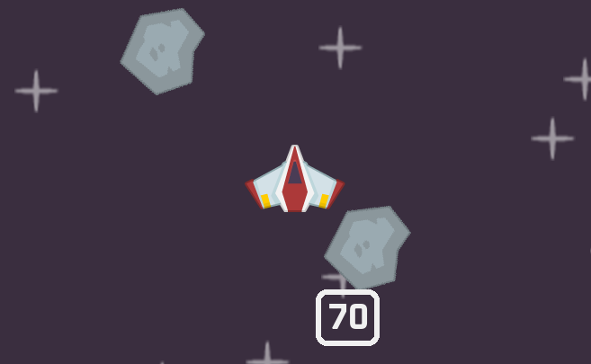

# Space Shooter

A space shooter game built with Python and Pygame where you should destroy meteors and survive as long as possible.



## ✨ Features

- **Spaceship controls** - Navigate with responsive keyboard controls
- **Collision detection** - Realistic hit detection between ship, lasers, and asteroids
- **Sound effects** - Immersive audio for shooting and explosions

## 🚀 How to Play

- **WASD** - Move your spaceship
- **Spacebar** - Fire lasers

### Objectives

- Avoid colliding with asteroids
- Survive as long as possible!

## 🛠️ Installation

### Prerequisites

- Python 3.12 or higher
- pip (Python package installer)

### Setup

1. **Clone the repository**

```bash
git clone https://github.com/yourusername/space-shooter.git
cd space-shooter
```

2. **Create a virtual environment**

```bash
python -m venv venv
source venv/bin/activate  # On Windows: venv\Scripts\activate
```

3. **Install dependencies**

```bash
pip install -r requirements.txt
```

4. **Run the game**

```bash
python code/main.py
```

**Or just press arrow button in your IDE**

### **🚀Enjoy!**